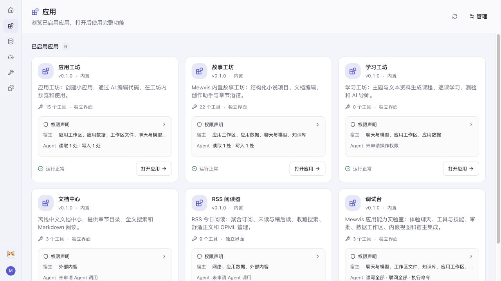
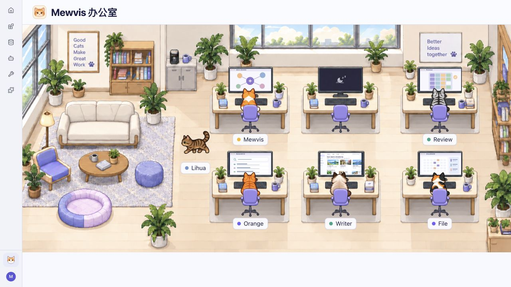

<p align="center">
  
</p>

<h1 align="center">Mewvis</h1>

<p align="center">可扩展的 AI 工作台</p>

<p align="center">
  
  
  
</p>

<p align="center">
  <a href="#核心模块">核心模块</a> ·
  <a href="#界面预览">界面预览</a> ·
  <a href="#快速开始">快速开始</a> ·
  <a href="docs/README.md">开发文档</a>
</p>

Mewvis 是一个支持桌面端和 Web 的 AI 工作台，提供模型接入、对话、Agent 执行、工作区和知识库管理，并通过应用与插件扩展不同的使用场景。

## 核心模块

### 模型与 Agent

统一管理模型服务与对话，支持 OpenAI、Anthropic、Google Gemini 及 OpenAI 兼容接口。Agent 可以使用工具和技能读取文件、修改内容、执行命令，并通过权限与审批设置控制执行范围。需要分工时，可为多个 Agent 配置不同角色、模型和工具，组织协作流程。

### 工作区与知识库

以本地目录组织项目，集中管理文件与会话，保存和继续已有对话。知识库将导入的文本资料按集合组织，为对话和 Agent 任务提供检索上下文。

### 应用

应用承载独立的界面和业务流程，拥有自己的设置、数据与会话。开发者可以通过应用 SDK 接入聊天、宿主工具、数据存储和工作区能力，为不同场景开发专门的界面。项目内置应用工坊、故事工坊、学习工坊、RSS 阅读器、文档中心和调试台，覆盖创作、学习、阅读与开发调试。

### 插件

插件扩展已有的会话和 Agent 执行流程，可提供工具、技能、命令、上下文处理与会话侧栏。用户可以在插件管理中配置、启用或停用插件。内置插件包括协作流程、智能判断和会话链路查看器，开发者也可以通过插件 SDK 接入自己的能力。

## 界面预览

**应用选择**

集中浏览已启用的应用，查看功能与权限声明，选择应用进入创作、学习或阅读界面。



**课程学习**

课时目录、教学内容与 AI 导师在同一界面中呈现，支持逐课学习、公式讲解、互动实验和测验。


**办公室**

猫咪在像素办公室中按各自偏好走动、休息和切换活动。点击角色或显示器，可以查看活动详情与工位屏幕。



## 快速开始

### 环境要求

- Node.js **22.19 或更高版本**。
- pnpm **8.15.9**。
- 桌面端开发需要 Rust 和 Tauri 2 的平台依赖，详见 [桌面开发与构建](docs/guide/desktop.md)。

### 安装与启动

在仓库根目录安装依赖并构建 AI 包：

```sh
pnpm install --frozen-lockfile
pnpm build:ai
```

**桌面端**

```sh
pnpm dev:desktop
```

**Web**

```sh
pnpm dev:web
```

启动后，在设置中添加模型服务并选择模型，再打开或创建工作区。内置应用从应用列表进入。

应用数据默认保存在 `~/.mewvis`，项目文件保存在所选工作区。安装包构建与平台配置见 [桌面开发与构建](docs/guide/desktop.md)，Web 服务配置见 [后端服务](docs/runtime/server.md)。

## 开发文档

完整中文文档见 [文档首页](docs/README.md)与 [目录](docs/SUMMARY.md)，也可在应用内的「文档中心」离线阅读。

| 文档                                       | 内容                             |
| ------------------------------------------ | -------------------------------- |
| [应用开发](docs/apps/development.md)       | 创建、调试和打包应用             |
| [应用 SDK](docs/apps/sdk.md)               | 接入界面、聊天、数据与工作区能力 |
| [插件开发](docs/extensions/development.md) | 扩展宿主工具与 Agent 执行流程    |
| [Agent 运行时](docs/runtime/overview.md)   | 运行时架构、SDK 与通信协议       |
| [桌面开发](docs/guide/desktop.md)          | 平台准备、开发与安装包构建       |

## 参与贡献

欢迎通过 Issue 反馈问题或提出功能建议，通过 Pull Request 改进代码、文档、应用和插件。提交问题时，请提供运行环境、复现步骤与相关日志。

## 致谢

Mewvis 使用了 [Pi](https://github.com/earendil-works/pi) 的模型接入与 Agent 能力：

- `@earendil-works/pi-ai`：统一的模型调用接口。
- `@earendil-works/pi-coding-agent`：Agent 会话与工具执行能力。

Pi 源码通过 Git Subtree 引入，保存在 [`ai/pi`](ai/pi) 中，并保留其 [MIT 许可证](ai/pi/LICENSE)。感谢 Mario Zechner 和 Pi 的贡献者。其他开源依赖与第三方资源的来源和许可证保留在各自目录中。
