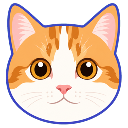
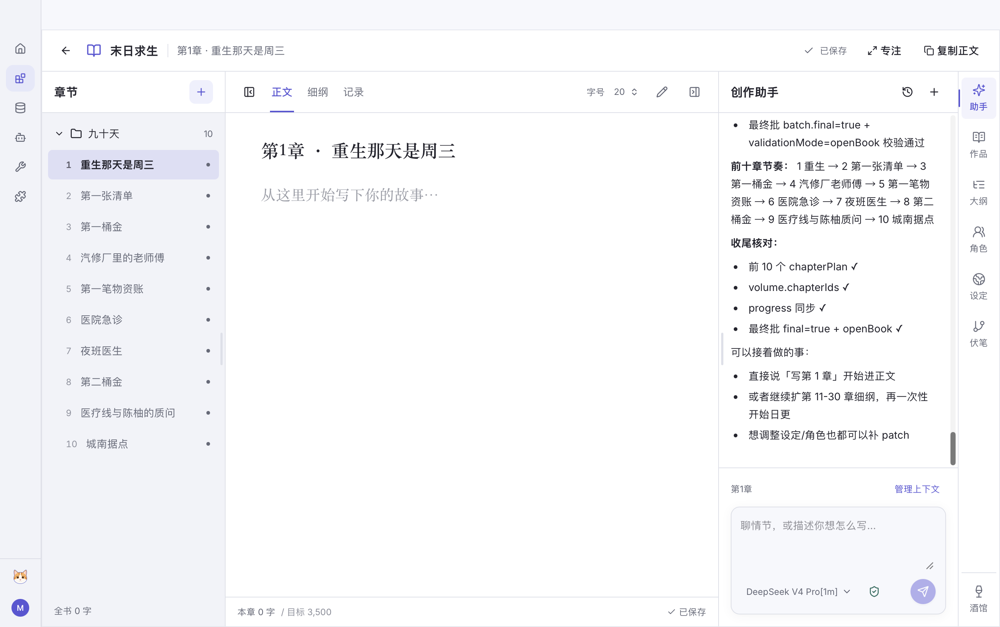
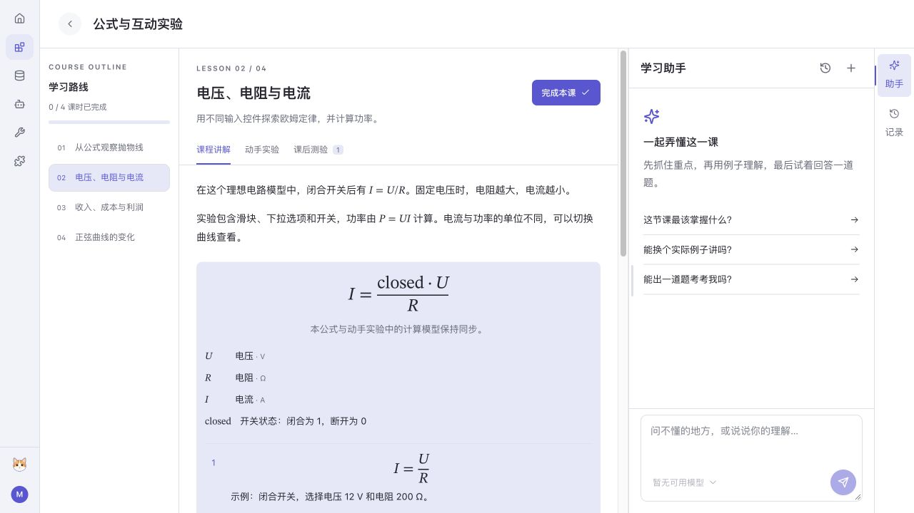
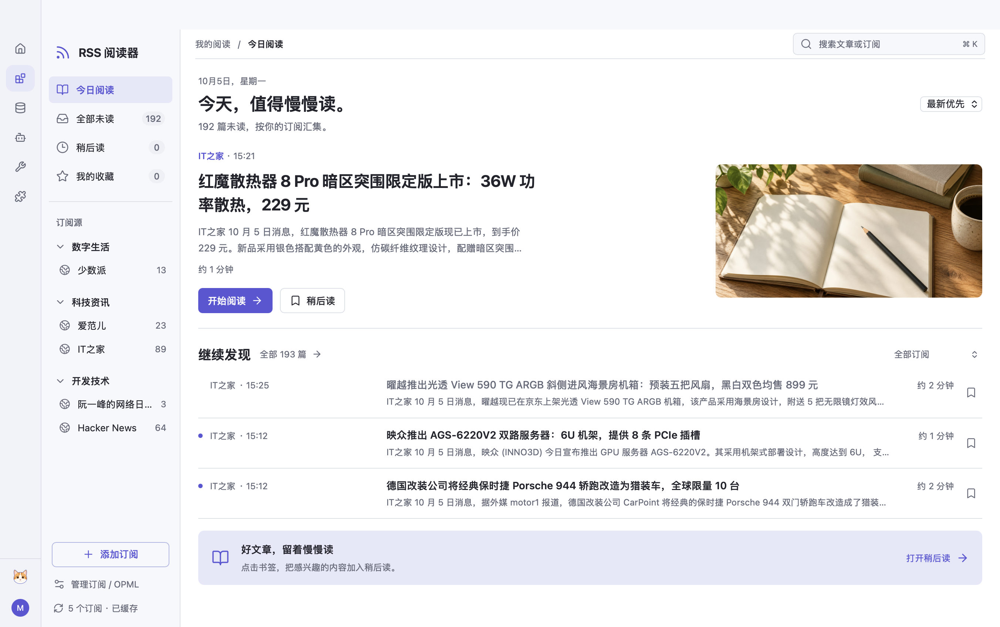
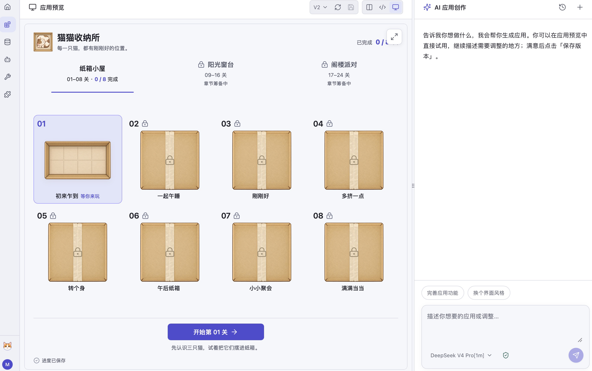

<p align="center">
  
</p>

<h1 align="center">🐾 Mewvis</h1>

<p align="center"><strong>从想法到应用，触手可及</strong></p>

<p align="center">
  
  
  
</p>

<p align="center">
  <a href="#getting-started">快速开始</a> ·
  <a href="#create-application"><strong>创建应用</strong></a> ·
  <a href="#extensions">插件扩展</a> ·
  <a href="https://creakycoss.github.io/mewvis/">开发文档</a>
</p>

---

> **基础交给 Mewvis，应用由你定义。** Mewvis 提供现成的基础能力与开发工具，方便你创建自己的 AI 应用，并按需通过插件扩展功能。

Mewvis 已准备好模型连接、聊天和数据保存等常用功能，让你把精力放在自己的 AI 应用上。你可以做一个按自己习惯整理资料的助手、一套适合自己的写作工具，或一个跟着课程学习的系统，自由安排界面、内容和 AI 参与的方式。

作为 AI 项目基座，Mewvis 提供现成的 SDK 与开发工具。通常只需开发自己的应用，复用已有的基础能力。代码可以自己写，也可以让 AI 参考开发文档和示例来编写，再放到 Mewvis 中运行和使用。

需要进一步扩展 AI 的工作方式时，可以使用或编写插件，例如让不同角色分工协作，或按自己的规则判断任务结果。仓库中现有的应用，以及角色协作、智能判断等插件，都是可供参考和改造的实现示例。

<a id="application-first"></a>

## 🧭 从应用开始

- **先开发应用**：设计自己的界面，组织业务数据，接入 AI 对话，添加需要的工具和技能。大多数需求可以在应用里实现，通过 `@mewvis/app-sdk` 使用基座能力，通常无需修改基础源码。
- **按需扩展插件**：当需求涉及不同应用共用的会话处理、任务协作等功能时，通过 `@mewvis/extension-sdk` 接入现有流程，由宿主统一管理启停和配置。
- **必要时修改基座**：只有应用 SDK 和插件扩展点都无法满足要求时，才修改相应的基础源码，增加新的能力。

详细边界见 [应用与宿主插件边界](docs/architecture/extensibility.md)。

<a id="foundation"></a>

## 🧱 基座提供什么

开发应用时，可以复用这些能力，将精力集中在自己的业务上：

| 能力 | 可以复用的内容 |
| --- | --- |
| **模型接入** | 统一配置模型服务与凭据，支持 OpenAI、Anthropic、Google Gemini 及 OpenAI 兼容接口 |
| **Agent 与任务执行** | 文件读取与修改、命令执行、子任务运行，以及执行权限、审批和可配置沙箱 |
| **会话与聊天** | 创建和恢复会话、流式消息、停止与追问；应用可使用默认 Chat，也可组合自己的聊天界面 |
| **数据与工作区** | 应用独立的业务存储、版本化设置和工作区管理，通过 SDK 接入持久化能力 |
| **应用工具与技能** | 定义业务工具和操作规则，让 AI 使用应用自己的功能 |
| **插件扩展** | 按需增加命令、监听事件、处理上下文，并通过宿主能力组织任务 |
| **开发与运行环境** | 应用模板、开发预览、检查与打包，插件创建、构建与校验，以及桌面和本机 Web 宿主 |

应用可以围绕自己的操作流程安排界面，同时复用同一套模型配置、聊天与数据服务。

项目文件和应用数据保存在本机，模型调用连接你配置的服务。执行范围与隔离能力随权限和平台配置生效，详见 [安全架构](docs/runtime/security/overview.md)。

<a id="getting-started"></a>

## 🚀 快速开始

先启动 Mewvis，再用应用模板开始自己的项目。下面的开发流程使用仓库内的 SDK。

### 1. 准备环境

- Node.js **22.19 或更高版本**
- pnpm **8.15.9**
- Git
- Linux：安装原生依赖需要 Python、C/C++ 编译工具和 make
- 桌面端：另需 Rust 和 Tauri 2 的平台依赖，见 [桌面开发与构建](docs/guide/desktop.md)

### 2. 获取源码与安装依赖

```sh
git clone https://github.com/CreakyCoss/mewvis.git
cd mewvis
pnpm install --frozen-lockfile
pnpm build:ai
```

### 3. 启动并配置模型

选择一种启动方式，在仓库根目录执行：

| 方式 | 命令 | 入口 |
| --- | --- | --- |
| 桌面端 | `pnpm dev:desktop` | Tauri 应用窗口 |
| 本机 Web | `pnpm dev:web` | 终端输出的浏览器地址，默认 `http://127.0.0.1:1420` |

启动后，在「设置 → 模型设置」中添加模型服务、填写所需凭据并选择模型。配置与应用数据默认位于 `~/.mewvis`，项目文件位于所选工作区。桌面与 Web 共用数据目录，切换入口前需退出当前后端。

<a id="create-application"></a>

## 🛠️ 创建自己的应用

从应用模板开始，逐步加入自己的界面、业务数据、工具和技能。开发工具链提供 React 模板、开发预览、类型检查与打包，应用通过 SDK 接入聊天、数据和工作区等能力。

可以在 Mewvis 仓库内开发，也可以单独维护一个应用项目。两种方式使用同一套应用 SDK，主要区别是源码放在哪里、如何构建和安装。根据自己的维护方式，选择下面一套流程即可。

| 开发方式 | 源码位置 | 构建与使用 |
| --- | --- | --- |
| **内部应用** | `apps/applications/builtins/<应用目录>` | 登记后随 Mewvis 一起构建，适合随项目维护和分发 |
| **外部应用** | 仓库外的独立项目 | 单独构建，通过「应用管理」导入，适合独立维护自己的应用 |

### 内部应用：在仓库中开发

#### 1. 创建应用项目

在 Mewvis 仓库根目录执行，目标目录需尚不存在：

```sh
pnpm --filter client build:chat-ui
pnpm --filter client app:create -- "$PWD/apps/applications/builtins/my-ai-app" --name @example/my-ai-app --local
```

#### 2. 接入工作区与打包流程

创建后，完成以下配置：

- 在新应用的 `package.json` 中，将 `@mewvis/app-sdk`、`@mewvis/product-config` 和 `@mewvis/app-dev` 三项依赖从 `link:...` 改为 `workspace:*`，其余依赖保留。
- 在 [pnpm-workspace.yaml](pnpm-workspace.yaml) 的 `packages` 列表中追加 `apps/applications/builtins/my-ai-app`，让 pnpm 管理新应用的依赖和命令。
- 在 [应用打包清单](apps/applications/registry.json) 的 `applications` 数组中追加目录名 `my-ai-app`，让它随 Mewvis 构建。这里填写目录名，应用 ID 则来自 `package.json` 的 `name`。
- 仓库文档统一放在 `docs/`。将模板生成的 `README.md` 移到 `docs/apps/my-ai-app.md`，调整其中的相对链接，并在 [文档目录](docs/SUMMARY.md) 中登记。

随后在仓库根目录安装依赖并启动应用预览：

```sh
pnpm install
pnpm --filter @example/my-ai-app dev
```

#### 3. 构建并在 Mewvis 中验证

完成修改后，在仓库根目录执行：

```sh
pnpm --filter @example/my-ai-app build
pnpm dev:web
```

`build` 会检查并生成应用产物。`pnpm dev:web` 会重新构建已登记的内部应用。在「应用管理」中启用应用，验证真实模型、工具与数据流程。也可以使用 `pnpm dev:desktop` 启动桌面端。

后续修改需要重新构建并重启 Mewvis，以加载新的产物。需要随桌面安装包分发时，在仓库根目录运行 `pnpm build:desktop`。

### 外部应用：作为独立项目开发

#### 1. 创建与预览

在 Mewvis 仓库根目录执行下面的命令，在仓库旁边创建一个新的应用项目：

```sh
pnpm --filter client build:chat-ui
pnpm --filter client app:create -- "$PWD/../my-ai-app" --name @example/my-ai-app --local
cd ../my-ai-app
pnpm install
pnpm dev
```

`--local` 让新项目链接当前仓库的 SDK 与开发工具链，适合这些工具包尚未独立发布时使用。项目目录需尚不存在。外部应用无需加入 Mewvis 的工作区或打包清单。

#### 2. 构建并导入

在应用项目中运行：

```sh
pnpm build
```

将生成的 `dist/mewvis` 目录通过 Mewvis「应用管理」导入并启用。

更新时，先重新构建，再卸载旧应用包并导入新产物。卸载只移除安装包，保留应用数据。

### 实现自己的需求

无论选择哪种开发方式，都可以从模板中的三个位置开始：

| 位置 | 主要用途 |
| --- | --- |
| `main/App.tsx` | 编写业务界面，接入默认 Chat 或组合聊天组件 |
| `main/host/` | 定义业务工具与技能，让 AI 使用应用自己的功能 |
| `app.config.ts` | 声明应用权限、Agent 访问范围和界面、宿主入口 |

如果由 AI 辅助开发，可以将自己的需求与 [应用开发](docs/apps/development.md)、[应用 SDK](docs/apps/sdk.md) 和 [应用聊天](docs/apps/chat.md) 一起提供给它，让它按公开接口实现界面、工具和数据逻辑。

> **开发预览**
>
> 预览使用内存聊天与测试适配，方便调整界面和工具。真实模型与工作区中的行为需在 Mewvis 中启用应用后验证。

<a id="examples"></a>

## 🖼️ 应用示例

现有应用展示了如何使用基座实现不同的需求。开发自己的应用时，可以参考其中的界面、工具和数据处理方式。

| 示例 | 可以参考的实现 |
| --- | --- |
| [故事工坊](apps/applications/builtins/story) | 业务编辑器、项目资料与 AI 会话的组合 |
| [学习工坊](apps/applications/builtins/learning) | 课程内容、互动界面与 AI 导师的组合 |
| [RSS 阅读器](apps/applications/builtins/rss-reader) | 订阅与文章管理、业务数据持久化 |
| [应用工坊](apps/applications/builtins/app-workshop) | AI 辅助编辑源码、浏览器子视图、构建与版本管理 |

<details>
<summary><strong>展开查看界面截图</strong> · 故事工坊、学习工坊、RSS 阅读器与应用工坊</summary>

### 故事工坊

故事工坊将章节编辑器与 AI 助手放在同一界面中：



### 学习工坊

学习工坊围绕课程组织内容与交互：



### RSS 阅读器

RSS 阅读器将订阅源、未读文章和稍后读集中在同一界面中：



### 应用工坊

应用工坊将应用预览与 AI 创作放在同一界面中，方便边试用边调整：



</details>

<a id="extensions"></a>

## 🔌 通过插件扩展能力

插件可以扩展应用与会话共用的能力，让 AI 按需要的方式处理任务。仓库中的几个插件展示了这类需求如何实现：

| 插件示例 | 扩展的能力 |
| --- | --- |
| [角色协作](apps/extensions/collaboration) | 定义不同角色和执行步骤，让多个角色按顺序协作，并查看进度、暂停或取消任务 |
| [智能判断](apps/extensions/decisions) | 设置自己的判断规则，让 AI 对任务结果给出判断、选择或评分，也可供协作流程调用 |
| [会话链路](apps/extensions/session-ledger) | 在会话侧栏查看运行过程和工具记录，并生成摘要 |

需要类似的功能时，可以使用现有插件，也可以从一个工具或命令开始编写自己的插件，再按需增加事件处理、上下文调整和界面扩展。

插件也可以在仓库内开发，或作为独立项目开发。两种方式使用同一套插件接口。

| 开发方式 | 源码位置 | 构建与使用 |
| --- | --- | --- |
| **内部插件** | `apps/extensions/<插件目录>` | 登记后随 Mewvis 构建，启动后由宿主发现和加载 |
| **外部插件** | 仓库外的独立项目 | 单独构建，通过「插件」管理页添加 |

### 内部插件：随 Mewvis 一起构建

#### 1. 创建并编写插件

在仓库根目录执行，目标目录需尚不存在：

```sh
pnpm extension create apps/extensions/my-feature --id example.my-feature
pnpm install --ignore-scripts
```

模板生成 `package.json` 和 `src/index.ts`，包含一个可修改的命令示例。将它改成自己的逻辑，并在清单中声明需要的能力。有界面需求时，再增加 UI 模块与贡献声明。

#### 2. 登记、构建与验证

`apps/extensions/*` 已包含在 pnpm 工作区中，无需逐个添加路径。要让新插件随 Mewvis 打包，还需在 [插件打包清单](apps/extensions/registry.json) 的 `extensions` 数组中追加目录名 `my-feature`。这里填写目录名，插件 ID 是创建时指定的 `example.my-feature`。

在仓库根目录检查构建结果，然后启动 Mewvis：

```sh
pnpm extension build apps/extensions/my-feature
pnpm extension validate apps/extensions/my-feature/dist/plugin
pnpm dev:web
```

启动命令会重新构建已登记的内部插件，也可使用 `pnpm dev:desktop` 启动桌面端。在「插件」管理页即可看到新插件，无需手动添加。内部插件默认启用，可以调整配置或停用。

修改源码后，重新构建并重启 Mewvis。需要随桌面安装包分发时，在仓库根目录运行 `pnpm build:desktop`。

### 外部插件：独立构建与添加

#### 1. 创建项目并链接 SDK

当前插件模板默认使用 `workspace:*` 依赖，放到仓库外时需改为本地 SDK 链接。以下示例假定 `mewvis` 与 `my-feature` 位于同一个父目录。在 Mewvis 仓库根目录执行：

```sh
pnpm extension create "$PWD/../my-feature" --id example.my-feature
```

将新项目 `package.json` 中的两项 Mewvis 依赖改为以下链接，其他字段保留。如果目录布局不同，相应调整链接路径：

```json
{
  "dependencies": {
    "@mewvis/extension-sdk": "link:../mewvis/packages/extension/sdk"
  },
  "devDependencies": {
    "@mewvis/extension-dev": "link:../mewvis/packages/extension/dev"
  }
}
```

外部插件无需加入 Mewvis 的工作区或打包清单。编写 `src/index.ts` 并按需调整清单，开发接口与内部插件相同。

#### 2. 构建、添加与更新

进入插件项目，安装依赖并构建：

```sh
cd ../my-feature
pnpm install --ignore-scripts
pnpm build
pnpm run validate
```

在 Mewvis「插件」管理页通过「添加插件」选择生成的 `dist/plugin` 目录，按需启用和配置。宿主登记的是这个目录的路径，需保留构建产物。

更新后重新构建，并重启 Mewvis 验证新代码。

需要分发时，可在插件项目中运行 `pnpm run pack` 生成 `dist/<插件ID>-<版本>.tgz`。接收者解压后，通过「添加插件」选择其中的 `package/` 目录。

完整流程见 [插件开发](docs/extensions/development.md)，能力与类型见 [插件 SDK](docs/extensions/sdk.md)。也可以把这些文档交给 AI，辅助编写和修改插件。

<a id="documentation"></a>

## 📚 开发文档

| 想了解什么 | 文档 |
| --- | --- |
| 应用创建、预览与打包 | [应用开发](docs/apps/development.md) |
| 应用可以调用的基座接口 | [应用 SDK](docs/apps/sdk.md) |
| 默认 Chat、组合界面与无界面聊天 | [应用聊天](docs/apps/chat.md) |
| 插件创建、加载、启停与配置 | [插件开发](docs/extensions/development.md) |
| 插件能力、模块与宿主服务 | [插件 SDK](docs/extensions/sdk.md) |
| Agent 运行时与通信协议 | [运行时概览](docs/runtime/overview.md) |
| 桌面构建与本机 Web 服务 | [桌面开发](docs/guide/desktop.md) · [后端服务](docs/runtime/server.md) |

完整中文文档见 [在线文档](https://creakycoss.github.io/mewvis/)，也可查看 [仓库文档](docs/README.md) 与 [目录](docs/SUMMARY.md)，或在示例应用「文档中心」中离线阅读。

<a id="contributing"></a>

## 🤝 反馈与贡献

欢迎通过 [Issue](https://github.com/CreakyCoss/mewvis/issues) 反馈问题或提出需求，通过 Pull Request 改进基座、SDK、开发工具链与示例。提交问题时，请提供运行环境、复现步骤和相关日志。也欢迎在 [LINUX DO](https://linux.do/) 交流。

<a id="license"></a>

## 📄 许可证与致谢

Mewvis 使用 [MIT 许可证](LICENSE)。第三方依赖与资源保留各自的许可证。

模型接入与 Agent 能力使用了 [Pi](https://github.com/earendil-works/pi) 的 `@earendil-works/pi-ai` 和 `@earendil-works/pi-coding-agent`。Pi 源码通过 Git Subtree 引入到 [`ai/pi`](ai/pi)，并保留其 [MIT 许可证](ai/pi/LICENSE)。感谢 Mario Zechner 和 Pi 的贡献者。
